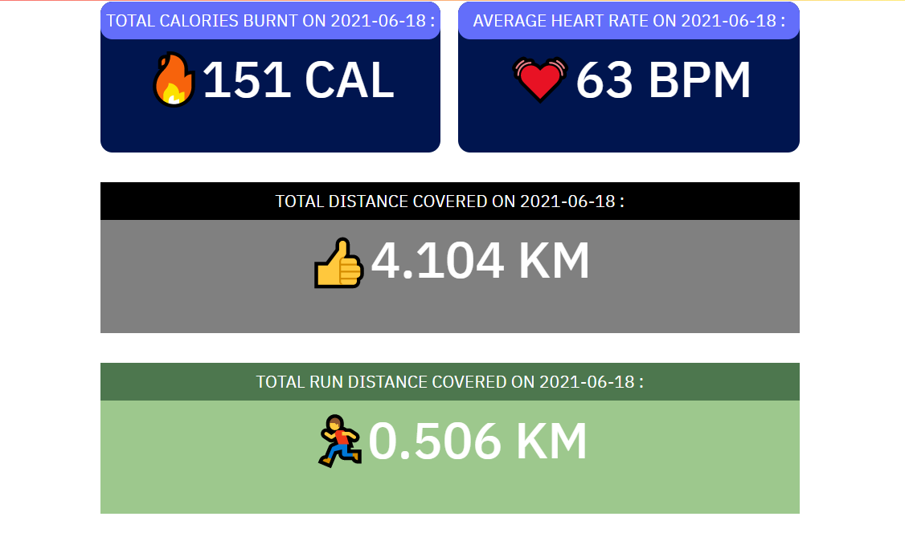
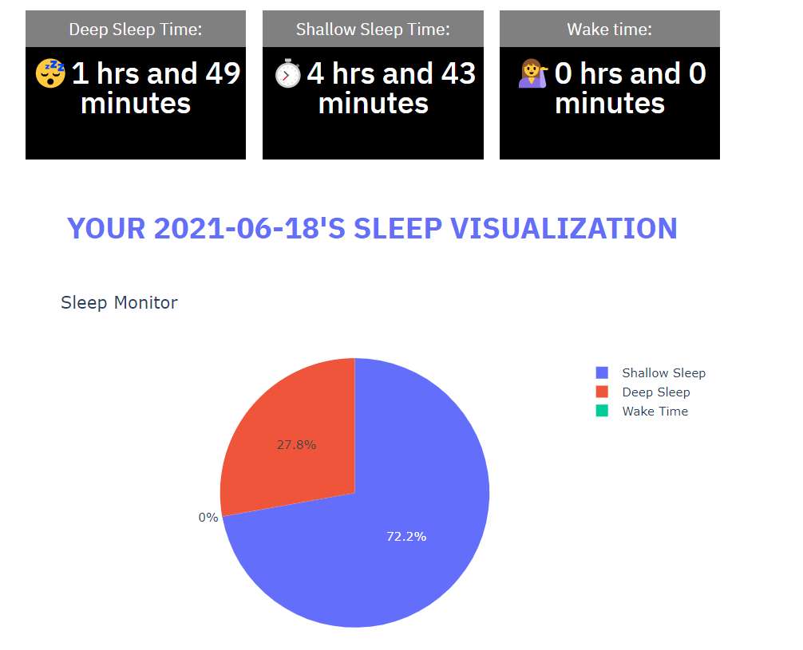

# MiBandDataVisualization
This project is about the real extraction of Data from MI Fitness Band using selenium and applying some anatomization and visualization on real data such as your health monitoring. 
`Note: Make sure that while using our web app, you put your business or educational email id which is attached to your MI Fit App on your smartphone.`  

<kbd></kbd>  
<kbd></kbd>  
<kbd></kbd>  
<kbd></kbd>  
<kbd></kbd>  
<kbd></kbd>  
<kbd></kbd>  
<kbd></kbd> 

### Languages Used:
  `1. Python`
  `2. HTML/CSS`
  
### Python Libraries/ Framework used:
  `1. Streamlit`
  `2. Selenium`
  `3. Altair`
  `4. Autoviz`
  `5. Matplotlib`
  `6. Numpy`
  `7. Pandas`
  `8. Plotly`
  `9. Pyperclip`
  `10. Scikit-Learn`
  `11. Scipy`
  `12. Seaborn`
  `13. Sklearn`
  `14. Statsmodels`
  `15. Twilio`
 
 # How to run this analysis in your local machine
1. Check your chrome version : `Open chrome > At the top right, look at More > Click Help > About Chrome.`
2. Go to `https://chromedriver.chromium.org/downloads` and download suitable chrome driver according to your chrome version.
3. Move the downloaded driver to `C:\Program Files (x86)`
4. Clone This Project: `git clone https://github.com/yashagg2001/MiBandDataVisualization.git`
5. Go to Project Directory: `cd MIBandDataVisualization`
6. Create a Virtual Environment: `python -m venv miui` (for windows)
7. Activate Virtual Environment: `miui\Scripts\activate.bat` (for windows)
8. Install Requirements Package: `pip install -r requirements.txt`
9. Run: `streamlit run user_interface.py`

To deactivate virtual environment: `deactivate` or `miui\Scripts\deactivate` 
To delete virtual environment (simply delete folder `miui`): `rmdir miui /s`
